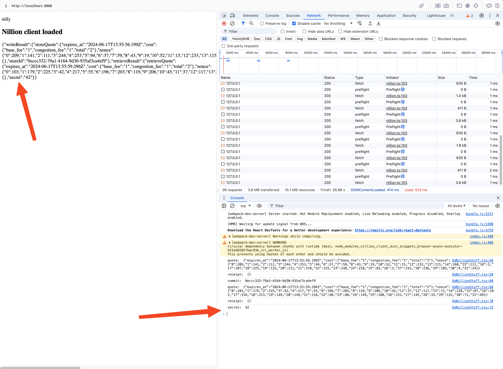

# Nilly

This:

1. Gets a quote from nilvm for secret storage
2. Pays for the operation via nilchain
3. Stores a secret by passing the receipt + value
4. Gets a quote from nilvm for secret retrieval
5. Pays for the operation via nilchain
6. Retrieves the secret value
7. Logs each step to the console and then prints everything out in the browser

## In one terminal run nillion-devnet

Until https://github.com/NillionNetwork/nillion/pull/1780 is merged you will need to run the devnet from
the `feat/nillion-devnet-proxy-cors-headers` branch. From the root of the nillion repo:

```shell
cd nillion
git fetch
git checkout -t origin/feat/nillion-devnet-proxy-cors-headers
cargo run -p nillion-devnet -- --seed nillion-devnet 
```

## In another terminal

```shell
cd nilly
npm install
npm run start
```

## In your browser

- Open http://localhost:8080
- Open dev tools
- If you see the secret number then it worked:


